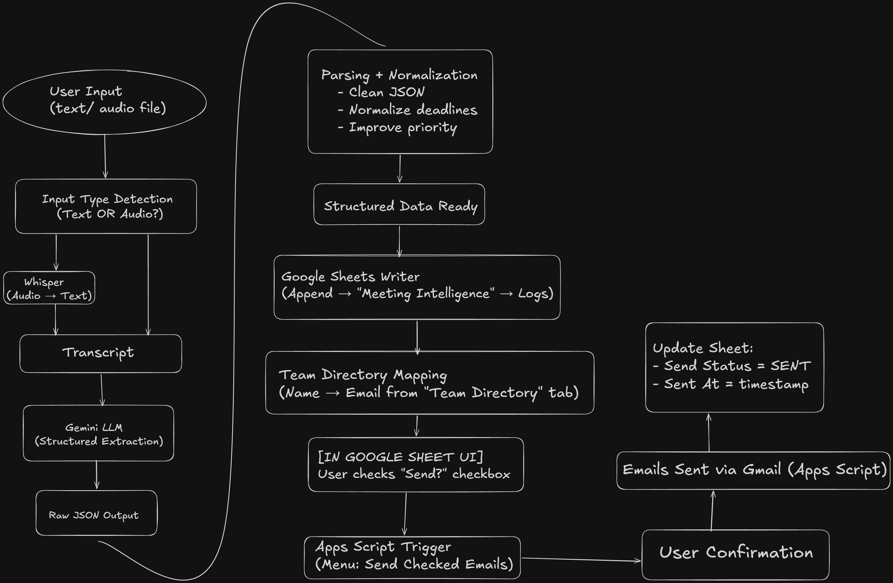
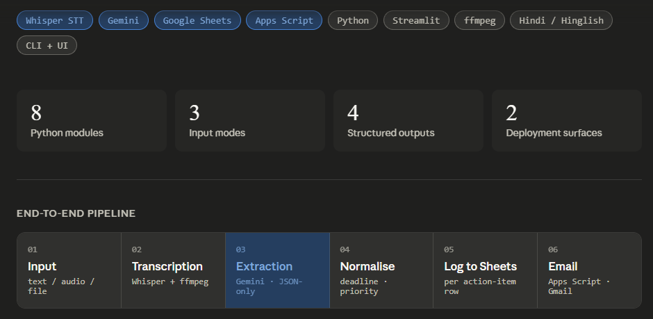
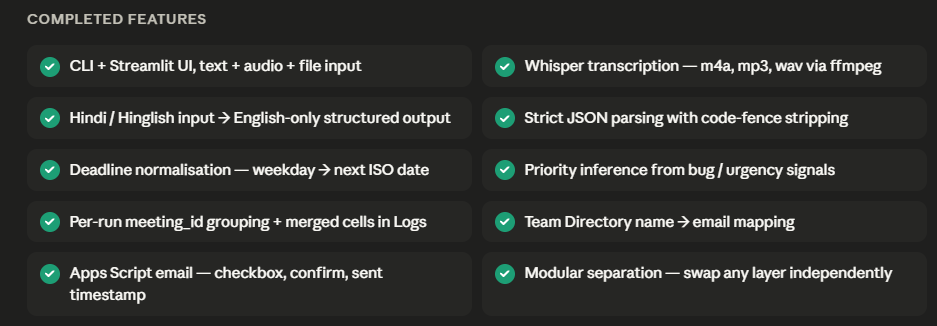
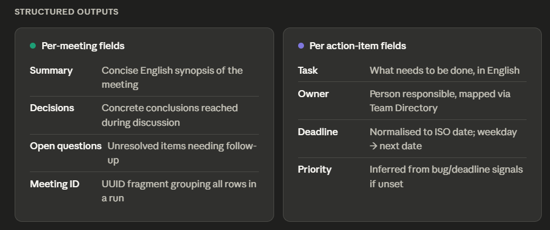
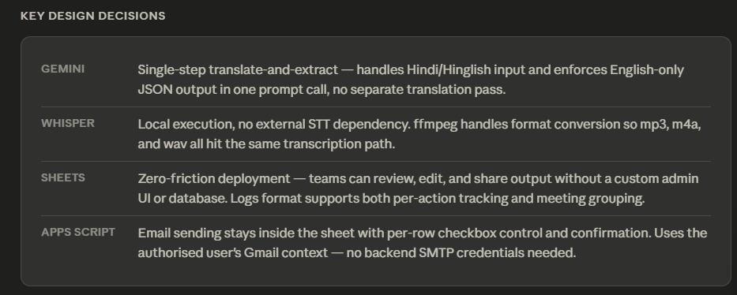
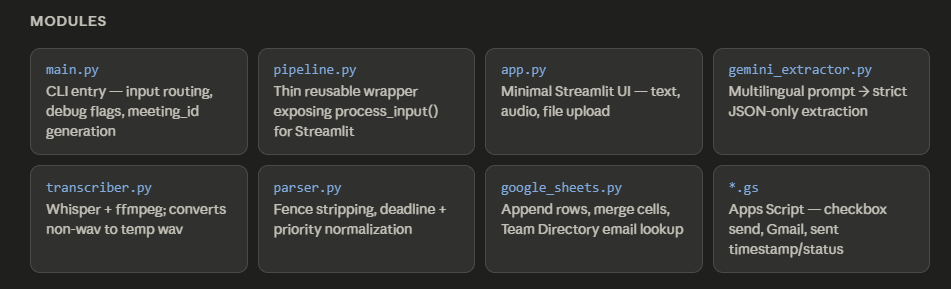

# 🧠 Meeting Intelligence Tool

Turn meeting **text or audio** into:

- a short **summary**
- clear **action items** (owner + deadline + priority)
- **key decisions**
- **open questions**

Then it automatically saves everything into **Google Sheets**, so your team can track work in one place.



---

## What you’ll see







---

## What it does (simple)

1) You give it a meeting transcript (paste text) or an audio recording.
2) It produces structured notes (summary, tasks, decisions, questions).
3) It logs the results into your Google Sheet **Meeting Intelligence → Logs**.
4) Optional: you can email action items from inside the sheet using a checkbox.

Works with English, Hindi, and mixed Hinglish input — the saved output is always **English**.

---

## Run it

### Option A: Command line

**Install once** (Windows PowerShell):

```powershell
cd "\Meeting Intelligence Tool"

python -m venv .venv
\.\.venv\Scripts\Activate.ps1

pip install -r requirements.txt
```

**Text input**:

```powershell
python main.py --text "David will fix the bug by Friday. Greg will define the UI. We decided to delay launch. What about testing timelines?"
```

**Audio input**:

```powershell
python main.py --audio "path\to\audio.m4a"
```

### Option B: Small web UI

```powershell
streamlit run app.py
```

---

## One-time setup

### 1) Create the Google Sheet

Create a Google Sheet named:

```text
Meeting Intelligence
```

Create two tabs:

- `Logs`
- `Team Directory`

In `Team Directory`, keep headers exactly:

```text
Name | Email
```

In `Logs` , headers must be like:

```test
Timestamp | Meeting_ID | Summary | Task | Owner | Deadline | Priority | Decision | Open Question
```

### 2) Add your Gemini key

Create `.env` in the project root:

```text
GEMINI_API_KEY=your_api_key
```

### 3) Add Google access (service account)

To write into Google Sheets:

- Put your service account file at `credentials.json` (project root)
- Share the Google Sheet with the service account email (Editor access)

Security note: don’t commit real credentials to a public repo.

### 4) Audio support

Audio needs `ffmpeg` installed.

```powershell
winget install --id Gyan.FFmpeg
```

Restart VS Code after installing so PATH updates apply.

---

## Email action items from the sheet (optional)

This lets you send action items without leaving Google Sheets.

### Enable the menu

1) Open the Google Sheet → **Extensions → Apps Script**
2) Paste: [integrations/google_sheets_apps_script.gs](integrations/google_sheets_apps_script.gs)
3) Save and reload the sheet
4) Use the menu: **Meeting Intelligence → Send Checked Emails**

### How sending works

- Tick `Send?` for the rows you want to email
- Click **Send Checked Emails**
- Confirm in the dialog
- The sheet fills:
  - `Sent At` (date + time)
  - `Send Status`

---

## Troubleshooting

- **Google Sheet not found / permission errors**
  - Confirm the sheet name is exactly **Meeting Intelligence**
  - Confirm it’s shared with the service account email from `credentials.json`
- **Audio fails**
  - Confirm `ffmpeg -version` works
- **Need more detail**
  - Run with debug output:

```powershell
python main.py --text "..." --debug
```

---

## Summary

Meeting Intelligence Tool turns meetings into structured notes + action items, logs them into Google Sheets, and can optionally email owners directly from the sheet.
